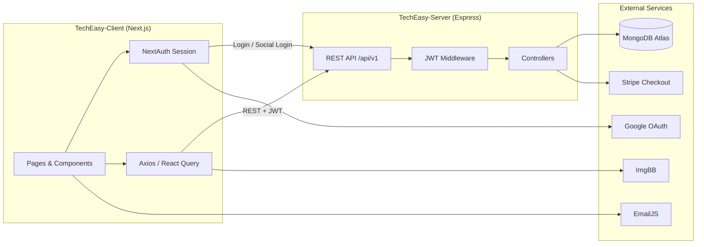

<div align="center">

# TechEasy


**A full-stack e-commerce platform for buying and selling tech products in Bangladesh.**

[Client Repo](https://github.com/Sultanmia22/TechEasy-Client) · [Server Repo](https://github.com/Sultanmia22/TechEasy-Server)

</div>

---

## Overview / About

**TechEasy** is a modern full-stack e-commerce application built with a **Next.js** frontend and an **Express + MongoDB** REST API backend. It delivers a complete online shopping experience — from product discovery and cart management to secure Stripe payments and role-based admin dashboards.

### Problem It Solves

Small and mid-sized tech retailers need an affordable, scalable platform to sell products online with user accounts, order tracking, payment processing, and admin oversight — without building everything from scratch.

### Key Highlights

- 🔐 **Dual authentication** — email/password login and Google OAuth via NextAuth, backed by JWT on the server
- 🛒 **End-to-end shopping flow** — browse, filter, cart, checkout, Stripe payment, and order confirmation
- 📊 **Role-based dashboards** — separate admin and customer views with real-time stats via MongoDB aggregation
- 🇧🇩 **Bangladesh-focused checkout** — district-based delivery charges (Dhaka: ৳80, outside: ৳120) and BDT Stripe payments

---

## Tech Stack

### Client (`TechEasy-Client/`)

| Category | Technologies |
|----------|-------------|
| **Framework** | Next.js 16, React 19, TypeScript |
| **Styling** | Tailwind CSS 4, DaisyUI 5 |
| **Auth** | NextAuth.js 4 (Credentials + Google OAuth) |
| **Data Fetching** | TanStack React Query 5, Axios, SWR |
| **Forms** | React Hook Form 7 |
| **UI / Icons** | Lucide React, React Icons, Swiper, Embla Carousel |
| **Notifications** | React Toastify, SweetAlert2 |
| **PDF / Screenshots** | jsPDF, modern-screenshot |
| **Contact** | EmailJS |
| **Image Upload** | ImgBB API |
| **Linting** | ESLint 9, eslint-config-next |

### Server (`TechEasy-Server/`)

| Category | Technologies |
|----------|-------------|
| **Runtime** | Node.js, TypeScript |
| **Framework** | Express.js 5 |
| **Database** | MongoDB, Mongoose 9 |
| **Auth** | JSON Web Token (JWT), bcrypt |
| **Payments** | Stripe |
| **Middleware** | CORS, dotenv |
| **Deployment** | Vercel Serverless (`@vercel/node`) |
| **Dev Tools** | ts-node-dev |

---

## Architecture

TechEasy follows a classic **client-server architecture**. The Next.js client communicates with the Express API over **REST (HTTP/JSON)**. Authentication tokens are issued by the server and attached to protected requests via the `Authorization: Bearer <token>` header.



| Communication | Protocol | Base URL |
|---------------|----------|----------|
| Client → Server API | REST (JSON) | `{NEXT_PUBLIC_API_URL}` → `/api/v1/*` |
| NextAuth → Server | REST (JSON) | `{NEXT_PUBLIC_BASE_URL}/api/v1/users/*` |
| Payment | Stripe Checkout redirect | Server creates session, client redirects |
| Contact form | EmailJS (client-side) | Direct to EmailJS API |
| Product images | ImgBB (client-side) | Direct to ImgBB API |

---

## Folder Structure

```
TechEasy/
├── README.md
├── techeasy.code-workspace
│
├── TechEasy-Client/
│   ├── public/
│   │   └── Logo.svg
│   ├── src/
│   │   ├── app/
│   │   │   ├── (auth)/
│   │   │   │   ├── login/
│   │   │   │   └── register/
│   │   │   ├── (main)/
│   │   │   ├── about/
│   │   │   ├── all-product/
│   │   │   │   └── [id]/
│   │   │   ├── api/auth/[...nextauth]/
│   │   │   ├── cart/
│   │   │   ├── checkout/
│   │   │   ├── contact/
│   │   │   ├── dashboard/
│   │   │   │   ├── (admin)/
│   │   │   │   │   ├── customerManagement/
│   │   │   │   │   ├── orderManagement/
│   │   │   │   │   └── productManagement/
│   │   │   │   ├── (customer)/
│   │   │   │   │   ├── myOrders/
│   │   │   │   │   │   └── [orderId]/
│   │   │   │   │   └── wishlist/
│   │   │   │   └── profile/
│   │   │   ├── payment-success/
│   │   │   ├── payment-cancel/
│   │   │   ├── globals.css
│   │   │   ├── layout.tsx
│   │   │   └── page.tsx
│   │   ├── Components/
│   │   │   ├── AllProducts/
│   │   │   ├── Auth/
│   │   │   ├── Button/
│   │   │   ├── CartComponent/
│   │   │   ├── Checkoutform/
│   │   │   ├── Contact/
│   │   │   ├── Dashborad/
│   │   │   │   ├── (Admin)/
│   │   │   │   ├── (Customer)/
│   │   │   │   ├── DashboradHome/
│   │   │   │   └── SideBar/
│   │   │   ├── Home/
│   │   │   ├── Layouts/
│   │   │   ├── Loading/
│   │   │   ├── Logo/
│   │   │   ├── NavLink/
│   │   │   ├── ProductCard/
│   │   │   └── Theme/
│   │   ├── hook/
│   │   │   ├── useAuth.ts
│   │   │   ├── useAxiosSecure.ts
│   │   │   ├── useCart.ts
│   │   │   ├── useDashboardContext.ts
│   │   │   └── useDashboardData.ts
│   │   ├── lib/
│   │   │   ├── axiosInstance.ts
│   │   │   ├── format.ts
│   │   │   └── imageUpload.ts
│   │   ├── Providers/
│   │   │   ├── DashboardProvider.tsx
│   │   │   ├── LayoutProvider.tsx
│   │   │   └── NextAuthProviders.tsx
│   │   ├── types/
│   │   └── proxy.ts
│   ├── next.config.ts
│   ├── postcss.config.mjs
│   ├── eslint.config.mjs
│   └── package.json
│
└── TechEasy-Server/
    ├── api/
    │   └── index.ts              # Vercel serverless entry
    ├── src/
    │   ├── config/
    │   │   └── index.ts
    │   ├── controller/
    │   │   ├── cart.controller.ts
    │   │   ├── dashboard.controller.ts
    │   │   ├── orders.controller.ts
    │   │   ├── products.controller.ts
    │   │   ├── profile.controller.ts
    │   │   ├── user.controller.ts
    │   │   └── wishlist.controller.ts
    │   ├── middleware/
    │   │   └── authMiddleware.ts
    │   ├── models/
    │   │   ├── cart.model.ts
    │   │   ├── order.mode.ts
    │   │   ├── products.model.ts
    │   │   ├── user.model.ts
    │   │   └── wishlist.model.ts
    │   ├── routes/
    │   │   ├── index.ts
    │   │   ├── cart.route.ts
    │   │   ├── dashboard.route.ts
    │   │   ├── order.route.ts
    │   │   ├── products.route.ts
    │   │   ├── profile.route.ts
    │   │   ├── user.route.ts
    │   │   └── wishlist.route.ts
    │   ├── types/
    │   ├── app.ts
    │   └── server.ts
    ├── vercel.json
    ├── tsconfig.json
    └── package.json
```

---

## Features

### 🔐 Authentication

- User registration with name, email, password, image, and date
- Email/password login with bcrypt password hashing
- Google OAuth sign-in via NextAuth, synced to backend via `/users/socialLogin`
- JWT access tokens (7-day expiry) stored in NextAuth session
- Auto sign-out and redirect on 401/403 responses
- Route protection for `/cart` via Next.js proxy middleware (customers only)

### 👤 User Features

- 🏠 **Landing page** — hero, categories, popular products, features, statistics, services, testimonials, blog, FAQ, and newsletter sections
- 🔍 **Product catalog** — paginated listing with category, brand, name search, and price sort (`low` / `high`)
- 📦 **Product details** — single product view by MongoDB `_id`
- 🛒 **Shopping cart** — add items, view pending cart items with subtotal, remove items
- ❤️ **Wishlist** — add, view (populated product data), and delete wishlist items
- 💳 **Checkout & payment** — shipping form with Bangladesh districts, delivery charge preview, Stripe Checkout session
- ✅ **Payment confirmation** — post-payment order verification via Stripe session retrieval
- 📋 **Order history** — list orders and view individual order details (items, shipping, delivery status)
- 🧾 **PDF receipt download** — generate order receipt PDF from order details
- 👤 **Profile management** — save/view personal info (phone, alt phone, DOB, gender, NID, occupation, location)
- 📍 **Address book** — save Home/Office addresses, view and delete by type
- 📊 **Customer dashboard** — order counts, wishlist preview, and recent orders summary
- 🌓 **Dark/light theme** — persisted theme toggle in dashboard
- 📧 **Contact page** — contact form powered by EmailJS
- ℹ️ **About page** — static about content

### 🛡️ Admin Features

- 📈 **Admin dashboard overview** — total orders, revenue, pending/delivered counts, recent orders, top-selling products, recent customers
- 📦 **Product management** — add products with specs, categories, stock, pricing; upload images via ImgBB
- 📋 **Product list** — search, category filter, price/date sort, paginated admin product table
- 🚚 **Order management** — view all customer orders; update delivery status (`pending`, `confirm`, `shipping`, `delivered`, `cancelled`)
- 👥 **Customer management** — list all users; change roles (`admin` / `customer`); ban/activate accounts; permanently delete users
- 📊 **Admin profile stats** — total users, products, orders, and revenue summary

### ⚙️ API Features

- Versioned REST API under `/api/v1`
- JWT Bearer token authentication middleware
- Role-based authorization (`admin` vs `customer`, configurable via `ADMIN_ROLE`)
- MongoDB aggregation pipelines for dashboard analytics
- Stripe Checkout integration with BDT currency
- Serverless-ready Vercel deployment handler with connection pooling
- CORS-enabled Express application

---

## API Endpoints

> Base path: `/api/v1`

### Auth / Users — `/users`

| Method | Endpoint | Description | Auth Required |
|--------|----------|-------------|:-------------:|
| `POST` | `/users` | Register a new user | No |
| `POST` | `/users/login` | Login with email and password; returns JWT | No |
| `POST` | `/users/socialLogin` | Create or login Google OAuth user; returns JWT | No |
| `PATCH` | `/users/savedPersonalInfo` | Save user personal info (phone, DOB, gender, etc.) | Yes |
| `GET` | `/users/getPersonalInfo` | Get personal info by `customerEmail` query | Yes |
| `PATCH` | `/users/saveAddress` | Save or update Home/Office address | Yes |
| `GET` | `/users/getAddress` | Get saved addresses by `customerEmail` query | Yes |
| `DELETE` | `/users/deleteAddress` | Delete address by `customerEmail` and `type` query | No |
| `PATCH` | `/users/updateRole` | Admin: change user role | Yes (Admin) |
| `PATCH` | `/users/bannedorActive` | Admin: ban or activate user account | Yes (Admin) |
| `DELETE` | `/users/deleteUser` | Admin: permanently delete user by email | No* |
| `GET` | `/users/allUser` | Admin: list all users | Yes (Admin) |

### Products — `/product`

| Method | Endpoint | Description | Auth Required |
|--------|----------|-------------|:-------------:|
| `GET` | `/product/popularProduct` | Get top 6 products sorted by rating | No |
| `GET` | `/product/filters` | Get distinct categories and brands | No |
| `GET` | `/product/allProduct` | Paginated product list with filters (`page`, `limit`, `category`, `brand`, `name`, `price`) | No |
| `GET` | `/product/productList` | Admin: paginated product list with search, category, sort | Yes (Admin) |
| `POST` | `/product/addProduct` | Admin: add a new product | Yes (Admin) |
| `GET` | `/product/:id` | Get single product by MongoDB `_id` | No |

### Cart — `/cart`

| Method | Endpoint | Description | Auth Required |
|--------|----------|-------------|:-------------:|
| `POST` | `/cart/addToCart` | Add product to cart (creates cart if none exists) | No |
| `GET` | `/cart/getCart/:email` | Get cart with pending items and subtotal | Yes |
| `PATCH` | `/cart/removeCart/:id` | Remove product from cart by product ObjectId | No |

### Orders — `/order`

| Method | Endpoint | Description | Auth Required |
|--------|----------|-------------|:-------------:|
| `POST` | `/order/create-checkout-session` | Create Stripe Checkout session for pending order | Yes |
| `GET` | `/order/confirmOrder` | Confirm payment status via Stripe session (`orderId`, `email` query) | Yes |
| `GET` | `/order/getSignleOrder` | Get single order by `customerEmail` and `orderId` query | Yes |
| `PATCH` | `/order/updateDeliveryStatus` | Admin: update order delivery status array | Yes (Admin) |
| `GET` | `/order/allOrderByAdminRequest` | Admin: get all orders with customer info | Yes (Admin) |

### Wishlist — `/wishlist`

| Method | Endpoint | Description | Auth Required |
|--------|----------|-------------|:-------------:|
| `POST` | `/wishlist/addwishlist` | Add product to wishlist | No |
| `GET` | `/wishlist/getwishlist` | Get wishlist by `customerEmail` query | No |
| `DELETE` | `/wishlist/deleteWishlist` | Remove product from wishlist by `customerEmail` and `productId` query | No |

### Dashboard — `/dashboard`

| Method | Endpoint | Description | Auth Required |
|--------|----------|-------------|:-------------:|
| `GET` | `/dashboard/getDashboradSummary` | Admin or customer dashboard stats (`email` query) | Yes |
| `GET` | `/dashboard/orders` | Get all orders for a customer by `customerEmail` query | No |

### Profile — `/profile`

| Method | Endpoint | Description | Auth Required |
|--------|----------|-------------|:-------------:|
| `GET` | `/profile/adminStats` | Admin: total users, products, orders, revenue | Yes (Admin) |

### Health Check

| Method | Endpoint | Description | Auth Required |
|--------|----------|-------------|:-------------:|
| `GET` | `/` | Server health check message | No |

> \* `/users/deleteUser` has no JWT middleware on the route, but the controller checks for admin role from the token payload.

---

## Environment Variables

### Server (`TechEasy-Server/.env`)

| Variable | Description | Required |
|----------|-------------|:--------:|
| `PORT` | Server port (default: `500`) | No |
| `MONGODB_URI` | MongoDB connection string | **Yes** |
| `DB_NAME` | MongoDB database name (default: `TechEasy`) | No |
| `JWT_SECRET` | Secret key for signing JWT tokens | **Yes** |
| `NEXTAUTH_SECRET` | Shared secret for NextAuth (used in server config) | **Yes** |
| `BCRYPT_SALT_ROUNDS` | bcrypt salt rounds (default: `12`) | No |
| `ADMIN_ROLE` | Role string for admin authorization checks (e.g. `admin`) | **Yes** |
| `STRIPE_SECRET_KEY` | Stripe secret key for checkout sessions | **Yes** |
| `CLIENT_URL` | Frontend URL for Stripe success/cancel redirects | **Yes** |
| `GEMINI_API_KEY` | Google Gemini API key (defined in config, not actively used in controllers) | No |

#### Server `.env.example`

```env
PORT=500
MONGODB_URI=mongodb+srv://<username>:<password>@cluster.mongodb.net
DB_NAME=TechEasy
JWT_SECRET=your_jwt_secret_here
NEXTAUTH_SECRET=your_nextauth_secret_here
BCRYPT_SALT_ROUNDS=12
ADMIN_ROLE=admin
STRIPE_SECRET_KEY=sk_test_xxxxxxxxxxxx
CLIENT_URL=http://localhost:3000
GEMINI_API_KEY=your_gemini_api_key_here
```

### Client (`TechEasy-Client/.env`)

| Variable | Description | Required |
|----------|-------------|:--------:|
| `NEXTAUTH_SECRET` | NextAuth session encryption secret (must match server) | **Yes** |
| `NEXTAUTH_URL` | Canonical URL of the Next.js app (recommended for NextAuth) | **Yes** |
| `NEXT_PUBLIC_API_URL` | Full API base URL including `/api/v1` prefix | **Yes** |
| `NEXT_PUBLIC_BASE_URL` | Server base URL for NextAuth credential/social login calls | **Yes** |
| `GOOGLE_CLIENT_ID` | Google OAuth client ID | **Yes** (for Google login) |
| `GOOGLE_CLIENT_SECRET` | Google OAuth client secret | **Yes** (for Google login) |
| `NEXT_PUBLIC_IMGBB_API_KEY` | ImgBB API key for admin product image uploads | **Yes** (for admin) |
| `NEXT_PUBLIC_EMAILJS_SERVICE_ID` | EmailJS service ID for contact form | **Yes** (for contact) |
| `NEXT_PUBLIC_EMAILJS_TEMPLATE_ID` | EmailJS template ID | **Yes** (for contact) |
| `NEXT_PUBLIC_EMAILJS_PUBLIC_KEY` | EmailJS public key | **Yes** (for contact) |

#### Client `.env.example`

```env
NEXTAUTH_SECRET=your_nextauth_secret_here
NEXTAUTH_URL=http://localhost:3000
NEXT_PUBLIC_API_URL=http://localhost:500/api/v1
NEXT_PUBLIC_BASE_URL=http://localhost:500
GOOGLE_CLIENT_ID=your_google_client_id
GOOGLE_CLIENT_SECRET=your_google_client_secret
NEXT_PUBLIC_IMGBB_API_KEY=your_imgbb_api_key
NEXT_PUBLIC_EMAILJS_SERVICE_ID=your_emailjs_service_id
NEXT_PUBLIC_EMAILJS_TEMPLATE_ID=your_emailjs_template_id
NEXT_PUBLIC_EMAILJS_PUBLIC_KEY=your_emailjs_public_key
```

---

## Getting Started

### Prerequisites

- **Node.js** 18+ (recommended: 20 LTS)
- **npm** 9+
- **MongoDB** — local instance or [MongoDB Atlas](https://www.mongodb.com/atlas) cluster
- **Stripe** account (test keys for development)
- **Google Cloud Console** project (for Google OAuth, optional)
- **ImgBB** API key (for admin product image uploads)
- **EmailJS** account (for contact form)

### Installation

```bash
# Clone both repositories
git clone https://github.com/Sultanmia22/TechEasy-Client.git
git clone https://github.com/Sultanmia22/TechEasy-Server.git

# Install server dependencies
cd TechEasy-Server
npm install

# Install client dependencies
cd ../TechEasy-Client
npm install
```

### Environment Setup

1. Copy the `.env.example` templates above into `TechEasy-Server/.env` and `TechEasy-Client/.env`
2. Fill in your MongoDB URI, JWT secret, Stripe keys, and OAuth credentials
3. Ensure `NEXTAUTH_SECRET` is identical in both client and server `.env` files
4. Set `NEXT_PUBLIC_API_URL` to point to your server's `/api/v1` endpoint

### Run the Project

```bash
# Terminal 1 — Start the server
cd TechEasy-Server
npm run dev
# Server runs on http://localhost:500 (or your configured PORT)

# Terminal 2 — Start the client
cd TechEasy-Client
npm run dev
# Client runs on http://localhost:3000
```

| Script | Location | Command | Description |
|--------|----------|---------|-------------|
| Dev | Server | `npm run dev` | Start Express with ts-node-dev (hot reload) |
| Build | Server | `npm run build` | Compile TypeScript to `dist/` |
| Start | Server | `npm start` | Run compiled server (`dist/server.js`) |
| Dev | Client | `npm run dev` | Start Next.js dev server |
| Build | Client | `npm run build` | Production build |
| Start | Client | `npm start` | Start production Next.js server |
| Lint | Client | `npm run lint` | Run ESLint |

---

## Database Models

### `Users` — Collection: `users`

| Field | Type | Description |
|-------|------|-------------|
| `name` | String | Full name (required) |
| `email` | String | Email address (required, unique) |
| `password` | String | Hashed password (optional — not set for Google users) |
| `date` | Date | Registration date |
| `image` | String | Profile image URL |
| `role` | String | `admin` or `customer` (default: `customer`) |
| `personalInfo.phone` | String | Primary phone |
| `personalInfo.altPhone` | String | Alternate phone |
| `personalInfo.dateOfBirth` | String | Date of birth |
| `personalInfo.gender` | String | Gender |
| `personalInfo.nidNumber` | String | National ID number |
| `personalInfo.occupation` | String | Occupation |
| `personalInfo.location` | String | Location |
| `address[]` | Array | Saved addresses (`id`, `type`, `name`, `address`, `city`, `country`, `phone`, `isDefault`) |
| `status` | String | `active` or `banned` (default: `active`) |
| `createdAt` / `updatedAt` | Date | Auto timestamps |

### `products` — Collection: `products`

| Field | Type | Description |
|-------|------|-------------|
| `id` | Number | Optional numeric product ID |
| `name` | String | Product name (required) |
| `brand` | String | Brand name (required) |
| `category` | String | Category (required) |
| `price` | Number | Price in BDT (required) |
| `rating` | Number | Product rating (default: 0) |
| `stock` | Number | Available stock (required) |
| `image` | String | Product image URL (required) |
| `description` | String | Product description |
| `specs` | Mixed | Key-value product specifications |
| `createdAt` / `updatedAt` | Date | Auto timestamps |

### `Carts` — Collection: `carts`

| Field | Type | Description |
|-------|------|-------------|
| `userEmail` | String | Owner email (required) |
| `items[].productId` | ObjectId | Reference to `products` (required) |
| `items[].quantity` | Number | Item quantity (min: 1, default: 1) |
| `items[].orderStatus` | String | `pending`, `success`, or `failed` |
| `createdAt` / `updatedAt` | Date | Auto timestamps |

### `CustomerOrder` — Collection: `customerorders`

| Field | Type | Description |
|-------|------|-------------|
| `email` | String | Customer email (required, unique) |
| `orders[].orderDate` | Date | Order placement date |
| `orders[].shippingInfo` | Object | `firstName`, `lastName`, `address`, `upazila`, `district`, `mobile`, `email`, `comment` |
| `orders[].items[]` | Array | `productId`, `name`, `price`, `quantity`, `image` |
| `orders[].totalPrice` | Number | Order subtotal |
| `orders[].deliveryCharge` | Number | Delivery fee (৳80 Dhaka / ৳120 other) |
| `orders[].paymentStatus` | String | `pending`, `paid`, or `failed` |
| `orders[].delivaryStatus` | String[] | Delivery pipeline: `pending`, `Confirm`, `Shipping`, `delivered` |
| `orders[].stripeSessionId` | String | Stripe Checkout session ID |
| `createdAt` / `updatedAt` | Date | Auto timestamps |

### `Wishlist` — Collection: `wishlists`

| Field | Type | Description |
|-------|------|-------------|
| `customerEmail` | String | Customer email (required) |
| `wishListItem[].productId` | ObjectId | Reference to `products` (required) |
| `createdAt` / `updatedAt` | Date | Auto timestamps |

---

## Deployment

### Client — Vercel

1. Push `TechEasy-Client` to GitHub
2. Import the repository in [Vercel](https://vercel.com)
3. Set all client environment variables in the Vercel dashboard
4. Deploy — Vercel auto-detects Next.js

### Server — Vercel (Serverless)

The server includes a `vercel.json` config and `api/index.ts` handler for serverless deployment:

1. Push `TechEasy-Server` to GitHub
2. Import in Vercel (or use [Railway](https://railway.app) / [Render](https://render.com) with `npm run build && npm start`)
3. Set all server environment variables
4. Update client `NEXT_PUBLIC_API_URL` and `NEXT_PUBLIC_BASE_URL` to the deployed server URL

### Database — MongoDB Atlas

1. Create a free cluster at [MongoDB Atlas](https://www.mongodb.com/atlas)
2. Whitelist your deployment IP (or `0.0.0.0/0` for serverless)
3. Copy the connection string into `MONGODB_URI`
4. Set `DB_NAME=TechEasy`

### Payment — Stripe

1. Create a [Stripe](https://stripe.com) account
2. Use test keys during development
3. Set `STRIPE_SECRET_KEY` on the server and `CLIENT_URL` to your frontend URL for redirect URLs

---

## Contributing

Contributions are welcome! To contribute:

1. Fork both repositories (`TechEasy-Client` and `TechEasy-Server`)
2. Create a feature branch: `git checkout -b feature/your-feature-name`
3. Make your changes and test locally (run both client and server)
4. Commit with a clear message describing the change
5. Push to your fork and open a Pull Request

Please keep changes focused, follow existing code conventions, and ensure both apps work together before submitting.

---

## License

This project is licensed under the **MIT License**.

```
MIT License

Copyright (c) 2026 TechEasy

Permission is hereby granted, free of charge, to any person obtaining a copy
of this software and associated documentation files (the "Software"), to deal
in the Software without restriction, including without limitation the rights
to use, copy, modify, merge, publish, distribute, sublicense, and/or sell
copies of the Software, and to permit persons to whom the Software is
furnished to do so, subject to the following conditions:

The above copyright notice and this permission notice shall be included in all
copies or substantial portions of the Software.

THE SOFTWARE IS PROVIDED "AS IS", WITHOUT WARRANTY OF ANY KIND, EXPRESS OR
IMPLIED, INCLUDING BUT NOT LIMITED TO THE WARRANTIES OF MERCHANTABILITY,
FITNESS FOR A PARTICULAR PURPOSE AND NONINFRINGEMENT. IN NO EVENT SHALL THE
AUTHORS OR COPYRIGHT HOLDERS BE LIABLE FOR ANY CLAIM, DAMAGES OR OTHER
LIABILITY, WHETHER IN AN ACTION OF CONTRACT, TORT OR OTHERWISE, ARISING FROM,
OUT OF OR IN CONNECTION WITH THE SOFTWARE OR THE USE OR OTHER DEALINGS IN THE
SOFTWARE.
```

---

<div align="center">

Built with ❤️ for tech shoppers in Bangladesh

</div>
